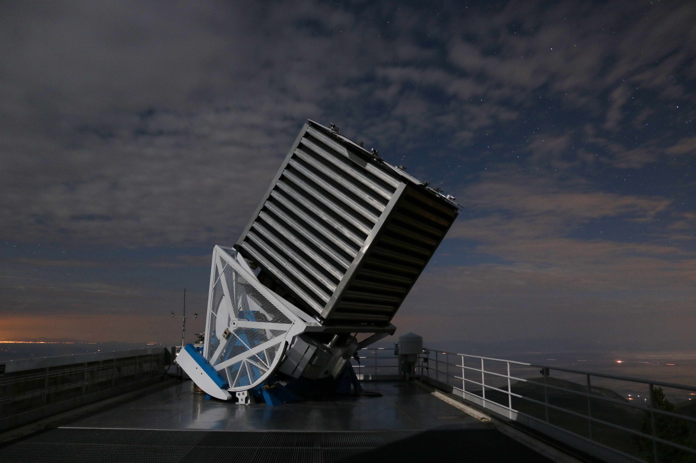

# Sloan Digital Sky Survey DR14 (Classification of Stars, Galaxies and Quasars)
   

Los datos presentados aquí se derivan de las observaciones realizadas por el Sloan Digital Sky Survey  (SDSS) que es proyecto de investigación del espacio mediante imágenes en el espectro visible, tales obsevaciones son realizadas con el objetivo de de expandir nuestra comprensión de la evolución a gran escala para de esta manera la estructura del universo, la formación de estrellas y galaxias.

           </img>
             

<b>

Imágen tomada de SDSS

</b>

Por medio del SDSS se ha creado el primer mapa tridimensional más detallado del universo con imágenes realizadas por un telescopio, el cual genera imágenes y espectros para más de tres millones de objetos astronómicos con imágenes profundas en varios colores de un tercio del cielo y espectros para más de tres millones de objetos astronómicos. Aprenda y explore todas las fases y encuestas (pasadas, presentes y futuras) del SDSS.

           
           

<b>

Telescopio de SDSS. Patrick Gaulme.

</b>

## Descripción

Este conjunto de datos está formado por 10,000 registros de observaciones del espacio tomadas por el Sloan Digital Sky Survey. Cada observación se describe mediante 17 columnas de características y 1 columna de destino que identifica la observación como una estrella, una galaxia o un cuásar. Algunas de las variables asociadas (u, g, r, i, z) están caracterizadas por el sistema de magnitud astronómica de Thuan-Gunn y que representan la respuesta de las 5 bandas del telescopio.

La toma de información obedece a una serie de mediciones como se muestra en la siguinete imagen:

           
           

<b>

Detección del telescopio de SDSS. tomada de SDSS

</b>

* objid = Identificador de objeto
* ora = J2000 Ascensión recta (banda r)
* odec = declinación J2000 (banda r)
* oEl sistema de magnitud astronómica de Thuan-Gunn. u, g, r, i, z representan la respuesta de las 5 bandas del telescopio:
* u = mejor ajuste de magnitud 1
* g = mejor ajuste de magnitud 2
* r = mejor ajuste de magnitud 3
* i = mejor ajuste de magnitud 4
* z = mejor ajuste de magnitud 5
* run = Número de ejecución 1
* rerun = Número de ejecución 2
* camcol = columna de cámara
* campo = número de campo

SpecObj:
* specobjid = Identificador de objeto
* class = clase de objeto (galaxia, estrella u objeto cuásar)
* redshift = Desplazamiento al rojo
* plate = número de placa
* mjd = MJD de observación
* fiberid = ID de fibra

## Objetivo

Entrenar algoritmos de redes neuronales para poder clasificar las observaciones del espacio.
